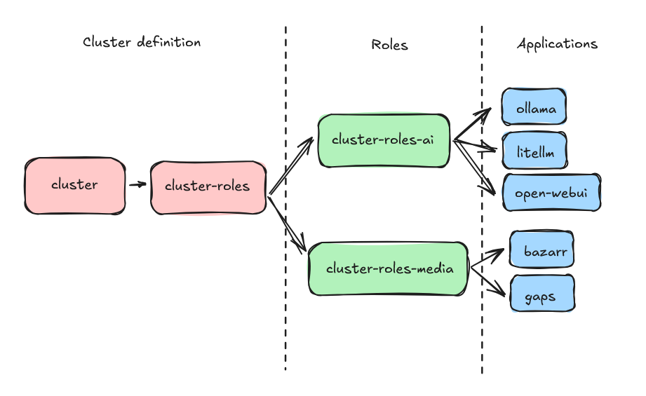

# OpenShift Argo CD Cluster Deployment Model

This repository implements an Argo CD-based GitOps deployment model for OpenShift/OKD clusters. It provides a structured approach to deploying and managing applications across different functional domains through a hierarchical role-based system.

## Architecture Overview

The deployment model follows a three-tier architecture:

1. **Cluster Definition** (`/cluster`) - Bootstrap configuration and role management
2. **Roles** (`/roles`) - Functional groupings that define which applications to deploy
3. **Charts** (`/charts`) - Individual Helm charts for each application



## Repository Structure

```text
├── cluster/                    # Cluster bootstrap configuration
│   ├── Chart.yaml             # Main cluster Helm chart
│   ├── values.yaml            # Cluster-wide configuration
│   └── templates/
│       └── roles.yaml         # ApplicationSet for role deployment
├── roles/                     # Functional role definitions
│   ├── ai/                    # AI/ML applications role
│   │   ├── Chart.yaml
│   │   └── templates/
│   │       ├── litellm.yaml   # LiteLLM application definition
│   │       ├── ollama.yaml    # Ollama application definition
│   │       └── openwebui.yaml # Open WebUI application definition
│   ├── media/                 # Media applications role
│   │   ├── Chart.yaml
│   │   └── templates/
│   │       ├── bazarr.yaml    # Bazarr application definition
│   │       └── gaps.yaml      # Gaps application definition
│   └── utilities/             # Utilities and system tools role
│       ├── Chart.yaml
│       └── templates/         # Utility application definitions
└── charts/                    # Individual application Helm charts
    ├── ai/
    │   ├── litellm/          # LiteLLM proxy for LLM management
    │   ├── ollama/           # Local LLM runtime
    │   └── openwebui/        # Web UI for LLMs
    └── media/
        ├── bazarr/           # Subtitle management
        └── gaps/             # Media gap detection
```

## How It Works

### 1. Cluster Bootstrap

The cluster bootstrap process starts by deploying the main cluster chart, which creates an Argo CD ApplicationSet that manages all defined roles.

**Key file**: `cluster/values.yaml`

- Iterates through roles defined and creates individual Argo CD Application for each role
- All configuration values come from the `values.yaml` file

### 2. Role-Based Application Management

Each role represents a functional domain (AI/ML, Media, etc.) and contains:

- **Chart.yaml**: Helm chart metadata for the role
- **Templates**: Individual Argo CD Application definitions for each app in the role

### 3. Application Deployment

Each application in the `/charts` directory is a complete Helm chart with:

- **Kubernetes manifests**: StatefulSets, Services, Routes, etc.
- **OpenShift-specific resources**: SecurityContextConstraints, Routes
- **Integration features**: Console links, custom Application CRDs
- **Storage management**: PVCs with configurable storage classes

## Available Applications

### AI/ML Role

- **LiteLLM**: Unified API proxy for managing multiple LLM providers
- **Ollama**: Local large language model runtime
- **Open WebUI**: User-friendly web interface for interacting with LLMs

### Media Role

- **Bazarr**: Subtitle management for media files
- **Gaps**: Tool for finding missing movies in series

### Utilities Role

- **System utilities**: General purpose tools and utilities for cluster management
- **Development tools**: IDEs, code quality tools, and development utilities
- **Monitoring utilities**: Lightweight monitoring and diagnostic tools

## Configuration

### Cluster Configuration

Edit `cluster/values.yaml` to configure:

```yaml
spec:
  destination:
    server: https://kubernetes.default.svc
  source:
    repoURL: YOUR_REPO_URL
    targetRevision: HEAD

roles:
  - ai
  - media
  - utilities

config:
  cluster:
    top_level_domain: example.com
    name: cluster
    admin_email: admin@example.com
    timezone: America/New_York
    storage:
      config:
        storageClassName: your-storage-class
```

## OpenShift Integration Features

### Networking

- **Routes**: Automatic HTTPS routes with edge termination
- **Services**: ClusterIP services for internal communication

### UI Integration

- **Console Links**: Applications appear in OpenShift console menus
- **Cluster Homepage**: Startpunkt is used as the cluster homepage and every application is listed there

### Storage

- **Flexible storage**: Uses the default cluster CSI driver unless a different one is specified
- **NFS integration**: Shared storage for media applications via NFS
- **Backup annotations**: Kasten backup integration

## Customization

### Adding a New Application

1. Create a new Helm chart in the appropriate `/charts` subdirectory
2. Add an Application definition in the corresponding role's templates
3. The application will be automatically deployed by Argo CD

### Adding a New Role

1. Create a new directory in `/roles`
2. Add the role to `cluster/values.yaml` roles list
3. Create Application templates for the apps in that role

## Maintenance

- **Updates**: Renovate keeps the versions up to date
